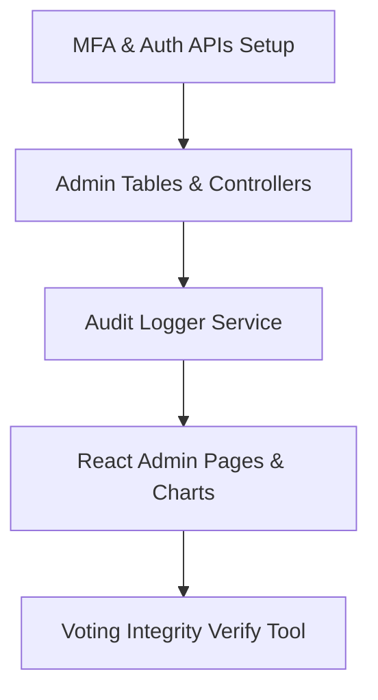

# TAPHE Secure Admin Panel: Architecture & Security Blueprint

Mwongozo huu unafafanua muundo wa kiusalama, usanifu wa kiufundi (technical architecture), na mpangilio wa kiutendaji kwa ajili ya kujenga eneo salama la utawala (Secure Admin Panel) kwa mfumo wa TAPHE Awards.

---

## 1. Usanifu wa Kiusalama (Security Architecture)

Lango la utawala (Admin Panel) ndilo eneo nyeti zaidi la mfumo. Ili kuzuia udukuzi, upotevu wa data, na hujuma kwenye matokeo ya kura, mfumo utalindwa kwa ngazi zifuatazo:

### A. Uthibitishaji wa Ngazi Mbili (Multi-Factor Authentication - MFA)
* **Hatua ya 1 (Password)**: Kuingia kwa barua pepe na nywila imara (bcrypt hashed with min 12 characters).
* **Hatua ya 2 (OTP Verification)**: Baada ya password kukubaliwa, mfumo utatuma nambari ya siri ya OTP ya tarakimu 6 kupitia SMS/WhatsApp kwa namba ya simu ya Admin iliyosajiliwa. Admin hawezi kupata dashboard bila kuingiza OTP hii.
* **Token Hardening (Laravel Sanctum)**: Token za Admin zitakuwa na muda wa ukomo (expire in 2 hours) na zitawekwa kwenye HTTP-Only Secure Cookies kuzuia mashambulizi ya XSS (Cross-Site Scripting).

### B. Usimamizi wa Madaraka (Role-Based Access Control - RBAC)
Admin watagawanywa katika makundi yenye nguvu tofauti:
1. **Super Admin**: Ana uwezo wa kufanya kila kitu (kuongeza admin wengine, kubadili mipangilio, CRUD zote, kuangalia ripoti za kifedha).
2. **Auditor (Mkaguzi)**: Ana uwezo wa kusoma data pekee (Read-Only) ili kukagua kura, mihamala ya malipo, na kutoa ripoti. Hawezi kufuta au kubadilisha data yoyote.
3. **Content Manager**: Ana uwezo wa kusimamia maudhui ya tovuti (habari, picha za gallery, orodha ya wadhamini). Hawezi kuona ripoti za kura au malipo ya kifedha.

### C. Daftari la Ukaguzi (Administrative Audit Trail)
* Kila kitendo kinachofanywa na Admin (kama vile kubadilisha jina la mshiriki, kufuta kategoria, au kubadili tarehe ya gala) kitarekodiwa kwenye jedwali la `audit_logs`.
* Kumbukumbu hizi zitajumuisha: `admin_id`, `action`, `model_affected`, `old_values (JSON)`, `new_values (JSON)`, `ip_address`, na `user_agent`.
* Kumbukumbu hizi zitakuwa zinalindwa kwa HMAC hashes kuzuia Admin mwingine kuzifuta au kuzibadilisha ili kuficha ushahidi.

### D. Ulinzi dhidi ya IDOR na Kubahatisha ID
* Viungo vya API vyote vya Admin vitatumia UUIDs badala ya auto-increment integers.
* Hii inazuia mtu kubahatisha ID za nominees au watumiaji wengine (IDOR/Insecure Direct Object Reference).

---

## 2. Jedwali za Hifadhidata (Database Schema Upgrades)

Ili kuunga mkono mifumo hii ya usalama, tutaunda/kurefusha jedwali zifuatazo:

```sql
-- 1. Jedwali la watumiaji wenye roles na MFA (UUID Keys)
-- Laravel Migration: $table->uuid('id')->primary();
CREATE TABLE admin_users (
    id CHAR(36) PRIMARY KEY, -- Hifadhi ya UUID String
    name VARCHAR(255) NOT NULL,
    email VARCHAR(255) UNIQUE NOT NULL,
    phone VARCHAR(20) UNIQUE NOT NULL,
    password VARCHAR(255) NOT NULL,
    role ENUM('super_admin', 'auditor', 'content_manager') DEFAULT 'content_manager',
    mfa_secret VARCHAR(255) NULL, -- Kwa ajili ya TOTP (Google Authenticator) ikihitajika
    is_active BOOLEAN DEFAULT TRUE,
    created_at TIMESTAMP DEFAULT CURRENT_TIMESTAMP,
    updated_at TIMESTAMP DEFAULT CURRENT_TIMESTAMP ON UPDATE CURRENT_TIMESTAMP
);

-- 2. Audit Trail Logger (UUID Keys)
-- Laravel Migration: $table->uuid('id')->primary();
CREATE TABLE audit_logs (
    id CHAR(36) PRIMARY KEY, -- Hifadhi ya UUID String
    admin_user_id CHAR(36) NOT NULL, -- UUID FK ya admin_users
    action VARCHAR(100) NOT NULL, -- e.g., 'UPDATE_NOMINEE', 'CLOSE_VOTING'
    model_type VARCHAR(100) NOT NULL, -- e.g., 'App\Models\Nominee'
    model_id CHAR(36) NOT NULL, -- UUID FK ya Model husika
    before_state JSON NULL,
    after_state JSON NULL,
    ip_address VARCHAR(45) NOT NULL,
    integrity_hash CHAR(64) NOT NULL, -- HMAC signature ya log kuzuia tampering
    created_at TIMESTAMP DEFAULT CURRENT_TIMESTAMP,
    FOREIGN KEY (admin_user_id) REFERENCES admin_users(id) ON DELETE CASCADE
);
```

---

## 3. Mpangilio wa Dashibodi ya React (Frontend Layout Subsystems)

Muonekano wa Admin Panel utajengwa kwa mtindo wa **White-Red Premium Luxury Dashboard Grid** uliotulia, ukionyesha takwimu sahihi:

```
+-----------------------------------------------------------------------+
|  TAPHE Admin  |  Active Season: [ 2026 v ]             [Admin User v] |
+-----------------------------------------------------------------------+
|  Dashboard    |  [Live Metrics Grid]                                  |
|  Categories   |  +------------+  +------------+  +------------+       |
|  Nominees     |  | Total Votes|  | Net Revenue|  | Ticket Qty |       |
|  Auditing     |  |   143,200  |  | 71.6M TZS  |  |    340     |       |
|  Transactions |  +------------+  +------------+  +------------+       |
|  Marathon     |                                                       |
|  Tickets      |  [Recent Audited Transactions / Vote Logs]            |
|  Settings     |  - Nominee A: 120 Votes Approved (Integrity OK)       |
|               |  - Nominee B: 10 Votes Flagged (Tampering Alert!)     |
+-----------------------------------------------------------------------+
```

### Kurasa Kuu za Utawala (Admin Views):

1. **Dashboard Overview**:
   * Chati ya mistari ya kura zinazoingia kwa saa (Live Votes charts).
   * Takwimu za mauzo ya tiketi na marathon.
   * Kitufe cha haraka cha kubadili msimu unaoendelea (*Season Switcher*).
2. **Excellence Auditing Desk (Dawati la Ukaguzi wa Kura)**:
   * Inaonyesha orodha ya nominees wote na kura walizopata.
   * Kitufe cha **"Verify DB Integrity"**: Kikibonyezwa, kinapitia kura zote moja baada ya nyingine, kukokotoa upya HMAC Hash kwa kutumia ufunguo wa siri, na kulinganisha na `integrity_hash` iliyopo kwenye database.
   * Ikipata kura yoyote ambayo haijalingana (tampered vote), inaweka alama nyekundu ya tahadhari na kuizuia isijumuishwe kwenye washindi.
3. **Transaction Logger**:
   * Ripoti ya malipo yote yaliyopitia AzamPay, MalipoPay na ZenoPay.
   * Utafutaji wa malipo kwa namba ya simu, jina, au kumbukumbu ya muamala (Transaction reference).
4. **Marathon & Ticket Registry**:
   * Orodha ya waliojisajili kukimbia na kununua tiketi.
   * Kitufe cha kusafirisha data (Export to Excel/PDF) kwa ajili ya maandalizi ya vifaa vya wakimbiaji.
5. **System & Event Control Grid**:
   * **Winners Switch**: Kuonyesha au kuficha ukurasa wa washindi kwenye tovuti ya umma.
   * **Voting Deadline Picker**: Kupanga tarehe na muda wa kufungua/kufunga zoezi la kupiga kura.
   * **Content Controller**: Kusimamia banners, reels, na picha za gallery.

---

## 4. Mpango wa Hatua za Utekelezaji (Implementation Phases)

Ili kujenga eneo hili salama, tutafuata hatua 4 zifuatazo:



1. **Mchakato wa Kwanza**: Kutengeneza API salama za Laravel za Login, OTP, na kusanidi majukumu ya Admin (RBAC/Sanctum middlewares).
2. **Mchakato wa Pili**: Kuunda Migration za `admin_users` na `audit_logs` na kuanzisha `AuditLogObserver` kiotomatiki.
3. **Mchakato wa Tatu**: Kujenga kurasa za React chini ya route ya `/admin` zikiwa zinalindwa na token checks.
4. **Mchakato wa Nne**: Kukamilisha zana ya Verify Integrity na kufanya majaribio ya udukuzi wa kura ili kuhakikisha mfumo unaozikataa kura zisizokuwa na saini halali.
